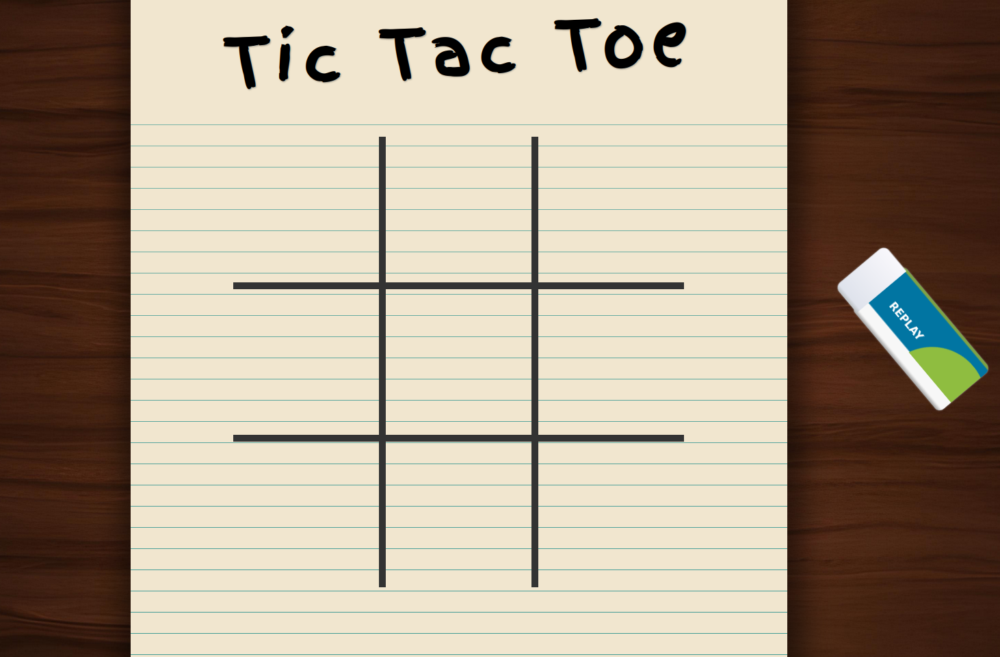

<h1 align="center">
  Tic-Tac-Toe-using-AI-Algorithm
</h1>
 

  
    
This project brings the classic game of Tic Tac Toe to life with a twist—artificial intelligence powered by the Minimax algorithm. Play against a smart computer opponent that analyzes moves, anticipates outcomes, and employs strategic decision-making to create an engaging and challenging gaming experience.
<h3 align="center">
  GUI of the Game
</h3>

  
